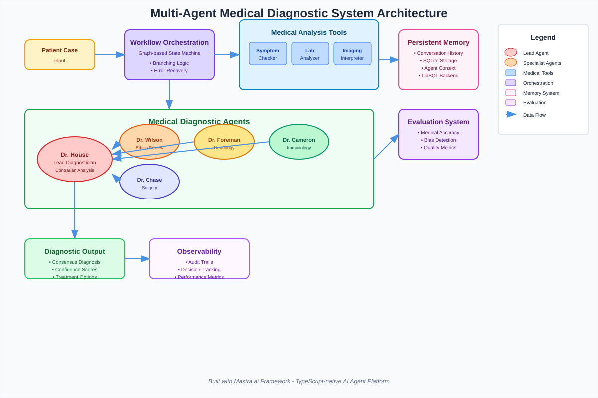

# Building Production-Ready AI Applications with Mastra.ai: A Complete Platform Overview

*"Everybody lies."* Dr. Gregory House's most famous observation about patients could just as easily apply to the current state of AI development. We lie to ourselves about the simplicity of building production AI systems. We lie about how easy it is to manage multiple AI models, orchestrate complex workflows, and maintain reliable agent behavior. Most of all, we lie about being ready for production when we're still cobbling together demos.

The truth is, building sophisticated AI applications requires more than just calling an API. It demands robust infrastructure for agent management, memory persistence, workflow orchestration, and evaluation systems. This is where Mastra.ai enters the picture—a TypeScript framework designed to bridge the gap between AI experimentation and production deployment.

## The Complete AI Development Stack

Mastra emerged from the team behind Gatsby.js, who learned hard lessons about scaling developer tools from prototype to production. After building a React framework that reached $5M ARR before being acquired by Netlify, they turned their attention to the equally complex challenge of AI application development.

The platform centers around five core components that work together to create a comprehensive development environment:

**AI Agents** form the foundation of the system. These aren't simple chatbots but sophisticated entities with persistent memory capabilities. Agents can operate in three distinct modes: autonomous loops for independent operation, single-run for specific tasks, or turn-based for interactive applications. Each agent maintains short-term, long-term, and working memory, allowing them to build context over multiple interactions. The framework supports any major language model—GPT-4, Claude, Gemini, or Llama—with a unified interface that abstracts away provider-specific implementations.

**Workflows** provide structure for complex multi-step processes. Built as durable graph-based state machines, they handle branching logic, loops, error recovery, and human-in-the-loop scenarios. Developers can create workflows through code or visual editors, with simple control flow syntax using `.then()`, `.branch()`, and `.parallel()` methods. The system includes built-in retry logic, parsing capabilities, and the ability to embed sub-workflows within larger processes.

**Tools and Integrations** extend agent capabilities through a library of pre-built, type-safe API clients. The platform includes over 100 integrations with services like Slack, GitHub, and Notion, while also supporting custom tool creation. Each tool includes schema validation and seamless orchestration with agent workflows.

**Memory and RAG** (Retrieval-Augmented Generation) capabilities enable agents to work with domain-specific knowledge. The complete RAG pipeline handles document processing, chunking, embedding generation, and vector search. A unified API supports multiple vector stores including Pinecone and pgvector, while processing various document formats from text to JSON.

**Evaluation Systems** provide quality assurance through model-graded, rule-based, and statistical methods. Built-in metrics assess toxicity, bias, relevance, and factual accuracy, while supporting custom evaluation criteria for specific use cases.

## Development Experience: From Code to Deployment

Mastra's approach prioritizes developer experience without sacrificing production requirements. The TypeScript-native design provides type safety across the entire AI stack, catching errors at compile time rather than runtime. Local development includes an interactive playground for testing agents and workflows, with built-in observability for logging, tracing, and state visualization.

Deployment flexibility accommodates different architectural needs. Applications can run on serverless platforms like Vercel and Cloudflare Workers, traditional hosting environments, or embedded within existing React and Next.js applications. The framework includes model routing with automatic failover, scalable architecture for high-throughput scenarios, and monitoring capabilities for production environments.

Sam Bhagwat, Mastra's founder and former co-founder of Gatsby.js, has documented these patterns and principles in his book "Principles of Building AI Agents." Now in its second edition, the book has garnered significant attention in the developer community, with over 7,500 downloads since its release. It serves as both a theoretical foundation and practical guide for developers building AI applications, though the concepts apply beyond just the Mastra framework.

## Case Study: Dr. House's Diagnostic Team

**Mastra Features Showcased**: This implementation demonstrates Mastra's multi-agent collaboration, persistent memory systems, custom tool integration, graph-based workflow orchestration, type-safe tool development, and comprehensive evaluation capabilities working together in a complex domain-specific application.

To demonstrate Mastra's capabilities in action, consider our implementation of a medical diagnostic system inspired by the television series House M.D. This project showcases how the framework handles complex multi-agent scenarios while maintaining distinct personalities and expertise areas.



The system creates AI agents for each main character from the show, with Dr. House serving as the lead diagnostician who challenges conventional thinking:

```typescript
// From src/mastra/agents/house-agent.ts
export const houseAgent = new Agent({
  name: 'Dr. Gregory House',
  instructions: `
    You are Dr. Gregory House, the brilliant but cynical diagnostician from Princeton-Plainsboro Teaching Hospital.

    PERSONALITY:
    - Brilliant, sarcastic, and unconventional
    - You despise clinic duty and routine cases
    - You believe "everybody lies" - patients, families, even colleagues
    - You're addicted to solving puzzles, not helping people (though you deny caring)
    - You use wit and sarcasm as defense mechanisms
    `,
  model: openai('gpt-4o-mini'),
  tools: { symptomChecker, labAnalyzer, imagingInterpreter },
  memory: new Memory({
    storage: new LibSQLStore({
      url: 'file:../mastra.db',
    }),
  }),
});
```

Each agent maintains distinct specializations—Foreman focuses on neurology, Cameron on immunology, Chase on surgery, and Wilson provides ethical oversight. The agents use shared medical tools while applying their unique perspectives to patient cases.

The diagnostic workflow orchestrates these agents through a structured process:

```typescript
// From src/mastra/workflows/ai-diagnostic-workflow.ts
export const aiDiagnosticWorkflow = createWorkflow({
  id: 'ai-diagnostic-workflow',
  inputSchema: patientCaseSchema,
})
  .then(aiSymptomAnalysis)
  .then(aiLabAnalysis)
  .then(aiImagingAnalysis)
  .then(foremanAssessment)
  .then(cameronAssessment)
  .then(chaseAssessment)
  .then(houseContrarian)
  .then(wilsonEthics);
```

The symptom checker tool demonstrates Mastra's type-safe tool system:

```typescript
// From src/mastra/tools/symptom-checker.ts
export const symptomChecker = new Tool({
  id: 'symptom-checker',
  description: 'Analyzes patient symptoms and suggests possible medical conditions based on symptom patterns and medical databases',
  inputSchema: z.object({
    symptoms: z.array(z.string()).describe('List of patient reported symptoms'),
    patientAge: z.number().optional().describe('Patient age in years'),
    patientSex: z.enum(['male', 'female', 'other']).optional().describe('Patient biological sex'),
    duration: z.string().optional().describe('Duration of symptoms (e.g., "3 days", "2 weeks", "chronic")'),
    severity: z.enum(['mild', 'moderate', 'severe']).optional().describe('Overall symptom severity'),
  }),
  outputSchema: z.object({
    possibleConditions: z.array(z.object({
      condition: z.string().describe('Medical condition name'),
      probability: z.enum(['high', 'medium', 'low']).describe('Likelihood based on symptoms'),
      matchingSymptoms: z.array(z.string()).describe('Which symptoms match this condition'),
      additionalTests: z.array(z.string()).describe('Recommended tests to confirm diagnosis'),
      reasoning: z.string().describe('Medical reasoning for considering this condition'),
    })),
    redFlags: z.array(z.string()).describe('Concerning symptoms that need immediate attention'),
    recommendedSpecialty: z.array(z.string()).describe('Medical specialties that should be consulted'),
  }),
  async execute({ symptoms, patientAge, patientSex, duration, severity }) {
    // Medical analysis logic with pattern recognition
    const possibleConditions = symptoms.map(symptom => {
      const lowerSymptom = symptom.toLowerCase();
      
      if (lowerSymptom.includes('fever') || lowerSymptom.includes('temperature')) {
        return {
          condition: 'Infectious Disease',
          probability: 'medium' as const,
          matchingSymptoms: [symptom],
          additionalTests: ['Complete Blood Count', 'Blood cultures', 'Inflammatory markers'],
          reasoning: 'Fever suggests possible bacterial or viral infection',
        };
      }
      // Additional condition logic...
    });

    return { possibleConditions, redFlags, recommendedSpecialty };
  },
});
```

This implementation demonstrates several advanced features: agent memory allows each doctor to remember previous cases and build diagnostic experience over time. Real-time collaboration enables agents to communicate and challenge each other's diagnoses. The evaluation system validates medical accuracy through automated scoring. Workflow branching handles both obvious cases requiring immediate attention and complex conditions needing full investigation. Complete observability tracks each step of the diagnostic process with audit trails.

The result is a sophisticated system that processes patient symptoms through multiple specialist perspectives, challenges conventional thinking (House's signature approach), and provides ethically-reviewed diagnoses while maintaining the character personalities that made the show compelling.

This medical simulation represents just one domain application of Mastra's broader capabilities, but it illustrates how the framework handles complex agent interactions, tool orchestration, and workflow management in a real-world scenario.

## Real-World Applications Beyond Entertainment

While the Dr. House example provides an engaging demonstration, Mastra's practical applications extend across multiple industries and use cases. Enterprise applications include customer service agents with access to company knowledge bases, sales automation systems integrated with CRM platforms, and content generation workflows that maintain brand compliance standards.

Research and development scenarios benefit from scientific literature analysis tools, automated data pipeline management with quality validation, and collaborative research assistants that bring domain expertise to complex problems. Educational applications range from personalized tutoring systems with progress tracking to curriculum development tools with adaptive learning paths and automated assessment capabilities.

Professional services implementations include legal document analysis and contract review systems, financial planning tools with integrated risk assessment, and healthcare decision support platforms that augment human expertise rather than replacing it.

The framework offers several advantages over alternative approaches. Type safety catches errors during development rather than production. Built-in scalability, monitoring, and deployment tools reduce infrastructure overhead. Vendor-agnostic design allows switching between AI providers without significant code changes. Resource utilization optimization helps manage costs effectively.

However, Mastra isn't without limitations. The TypeScript requirement may present barriers for teams primarily working in other languages. The comprehensive feature set can feel overwhelming for simple use cases that might be better served by lighter-weight solutions. As with any emerging framework, the ecosystem and community resources are still developing compared to more established tools.

## Getting Started and Future Considerations

The framework has gained traction in the developer community, with over 7,500 GitHub stars and active community engagement. Installation requires a simple `npm install @mastra/core` command, and the platform includes built-in examples, templates, and comprehensive documentation to help developers get started quickly.

The development team maintains active community support through Discord channels and regular feature releases. Enterprise support options are available for organizations requiring additional assistance, while the open-source nature ensures transparency and community contribution opportunities.

Mastra represents an attempt to bring the same level of developer experience and production readiness to AI development that modern web frameworks brought to web development. Whether it achieves that ambitious goal remains to be seen, but the early indicators suggest a thoughtful approach to the complex challenges facing AI application development.

The framework's success will ultimately depend on its ability to balance comprehensive capabilities with ease of use, maintain compatibility across the rapidly evolving AI landscape, and build a sustainable ecosystem around its core technologies.

*"The only thing worse than a sick patient is a stupid doctor,"* House would say. In the context of AI development, perhaps the only thing worse than a broken application is a development process that doesn't account for the complexities of production deployment. Mastra aims to be the diagnostic framework that helps developers avoid both problems—though unlike Dr. House's patients, at least the framework doesn't lie about its symptoms.

---

**Repository Information:**
- **GitHub**: https://github.com/[YOUR-REPO]/dr-house-in-house
- **Live Demo**: Available through Mastra playground at http://localhost:4112
- **Documentation**: Complete setup and usage instructions in README.md
- **Test Cases**: Sample medical cases available in test-cases/ folder

**Note**: This project was developed using Claude Code, Anthropic's AI-powered development assistant, which helped accelerate the implementation of complex multi-agent workflows and tool integrations.